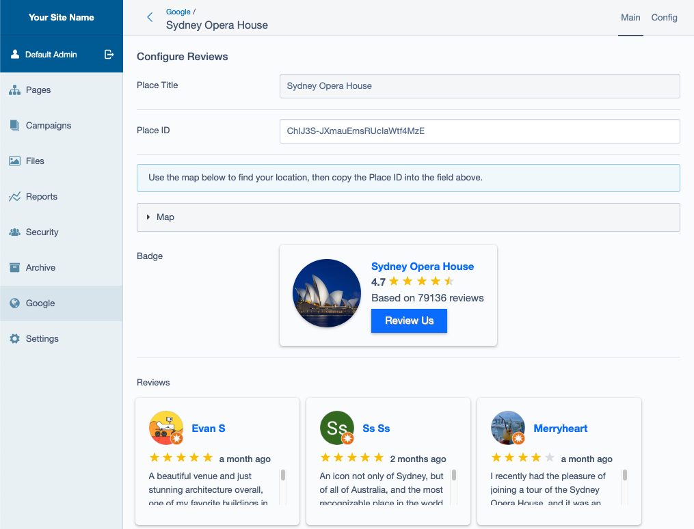

# Silverstripe Google Config

Provides an admin interface separate from the Settings panel that lets users manage things like their GTM scripts, reviews, etc.

## Installation (with composer)

	composer require iliain/silverstripe-google-config

## Config

Depending on which APIs you're using, you may need to include environment variables for your keys, like so:

```
GOOGLE_MAPS_API_KEY="xxxxxxxxxxxxxxxxxxxxx"
```

Currently this module uses the following APIs:

* Google Places

## Usage

You can call data from the Google settings on the frontend via `$GoogleConfig`, like so:

```
{$GoogleConfig.HeadScripts.RAW}

<% with $GoogleConfig %>
    <% if $Places %>
        <% loop $Places %>
            ...
        <% end_loop>
    <% end_if %>
<% end_with %>
```

## Places 

Setting up a Place in the CMS, with an example of the Review data



With a selected Place, you can render the badge and feed in your template with `$ReviewBadge` and `$ReviewsList` respectively.

## TODO

* Add more APIs
* Update CSS to properly render as-is on the frontend (like a widget)
